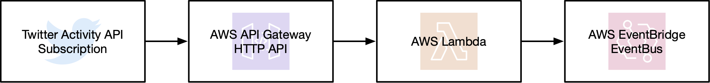

# twitter-eventsource-cdk
[AWS CDK](https://aws.amazon.com/cdk/) construct to publish [Twitter activity](https://developer.twitter.com/en/docs/accounts-and-users/subscribe-account-activity/overview) to [AWS EventBridge](https://aws.amazon.com/eventbridge/)

This construct creates a series of AWS resources to receive Twitter activity and publish it to an EventBus.  It also includes a custom resource to create (and destroy) the Twitter Activity API subscription along with the AWS infrastructure.

A complete deployment looks like this:



With this is in place you can create rules matching Twitter [activity events](https://developer.twitter.com/en/docs/accounts-and-users/subscribe-account-activity/guides/account-activity-data-objects) and route them to any EventBridge [supported target](https://docs.aws.amazon.com/eventbridge/latest/userguide/what-is-amazon-eventbridge.html).

## Usage

1.  Visit the [Twitter Developer site](https://developer.twitter.com) and create an App with Consumer API keys as well as an Access token and secret.

1.  Next, create an Account Activity API sandbox for your application (the free tier is fine for this use case).

1.  Store this App's credentials as SecureStrings in [AWS Systems Manager Parameter Store](https://docs.aws.amazon.com/systems-manager/latest/userguide/systems-manager-parameter-store.html) under the following names:

    * `/twitter/consumer_api_key` 
    * `/twitter/consumer_api_secret_key`
    * `/twitter/access_token` 
    * `/twitter/access_token_secret`

1.  [Install node.js](https://nodejs.org/en/download/) and create a new CDK stack project with `npx cdk init app --language typescript`.

1.  Install this project as a dependency with `npm install --save twitter-eventsource-cdk`.

1.  Edit the main file for your stack, import this new dependency and create the resource in your stack constructor:

    ```typescript
    import * as twitter from 'twitter-eventsource-cdk'
    
    // Inside stack constructor:
    const source = new twitter.EventSource(this, 'ActivityEventSource')
    ```

1.  If this is the first time using CDK in your AWS account, run `npx cdk bootstrap` before deploying.

1.  Finally, run `npx cdk deploy` and enjoy!

## How it works

* A custom EventBus named `twitter-activity` is created.
* An API Gateway HTTP endpoint is also created, with all requests routed to a lambda for processing.
* This lambda does the heavy lifting (along with a few [security](https://developer.twitter.com/en/docs/accounts-and-users/subscribe-account-activity/guides/securing-webhooks) functions):
    * Ensuring requests originate from Twitter's IP range
    * Answering Twitter's periodic challenge-response checks
    * Validating the signature header for activity POSTs
    * Sending this activity to the EventBus with a`DetailType` matching the [Activity message type](https://developer.twitter.com/en/docs/accounts-and-users/subscribe-account-activity/guides/account-activity-data-objects)
* Finally, a custom resource creates the Twitter Activity API subscription using the above HTTP endpoint as the webhook.

## To Do

* Write tests! :neutral_face:
* Support other CDK languages (beyond just TypeScript).